# Linux Multi-Container Runtime

## 1. Team Information
- **Monisha Agarwal** - [PES2UG24CS285]
- **M S Nikhil Chowdhary** - [PES2UG24CS253]

---

## 2. Build, Load, and Run Instructions

This runtime expects **Ubuntu 22.04 or 24.04** installed inside a Virtual Machine with **Secure Boot disabled**.

### ⚙️ Prerequisites
Ensure the system is ready with the underlying dependencies:
```bash
sudo apt update
sudo apt install -y build-essential linux-headers-$(uname -r)
```

### 🧱 Step 1 — Build the Project
Open a terminal (**Terminal 3**) and structurally clear and compile the binary matrix:
```bash
cd ~/project/boilerplate
make clean || true
make
```
*This builds:*
* `engine` (user-space runtime + supervisor)
* `monitor.ko` (kernel memory module)
* Associated workloads: `memory_hog`, `cpu_hog`, `io_pulse`

### 🧱 Step 2 — Load Kernel Module
Still inside **Terminal 3**, insert the Kernel tracking module:
```bash
sudo insmod monitor.ko
ls -l /dev/container_monitor
```
✔ *Condition*: You must see `/dev/container_monitor` populated actively.

### 🧱 Step 3 — Prepare Base Root Filesystem
Pull down the generic target Alpine distribution:
```bash
mkdir -p rootfs-base
wget https://dl-cdn.alpinelinux.org/alpine/v3.20/releases/x86_64/alpine-minirootfs-3.20.3-x86_64.tar.gz
tar -xzf alpine-minirootfs-3.20.3-x86_64.tar.gz -C rootfs-base
```

### 🧱 Step 4 — Bind Custom Workloads to RootFS
Push the local testing binaries directly into the generic root payload:
```bash
cp memory_hog cpu_hog io_pulse rootfs-base/
```

### 🧱 Step 5 — Create Independent Per-Container RootFS
Stamp out perfectly isolated execution directories explicitly for localized container manipulation:
```bash
cp -a rootfs-base rootfs-alpha
cp -a rootfs-base rootfs-beta
```

### 🧱 Step 6 — Multi-Terminal Organization
Divide your workspace locally into **3 physical terminals** for operational clarity:
| Terminal | Purpose |
| --- | --- |
| 🟢 **Terminal 1** | Primary Daemon / Supervisor Event Loop |
| 🔵 **Terminal 2** | Raw `dmesg` Kernel Log Monitoring |
| 🟡 **Terminal 3** | IPC Command Line Client Iterations |

### 🧱 Step 7 — Start Supervisor
Inside 🟢 **Terminal 1**, instantiate the underlying background supervisor daemon tracking endpoints:
```bash
cd ~/project/boilerplate
sudo ./engine supervisor ./rootfs-base
```
✔ *Expected Response*: `Supervisor listening on /tmp/mini_runtime.sock`

### 🧱 Step 8 — Start Kernel Log Monitoring
Inside 🔵 **Terminal 2**, initiate the absolute ring-0 diagnostic log pipeline:
```bash
sudo dmesg -w
```
*(Leave this running to observe real-time LKM memory enforcement violations.)*

### 🧱 Step 9 — Launch Parallel Containers
Switch seamlessly to 🟡 **Terminal 3** and aggressively launch independent processes enforcing Absolute Paths strictly across IPC parameters:
```bash
cd ~/project/boilerplate

# Boot Memory process capped strictly
sudo ./engine start alpha $(pwd)/rootfs-alpha /memory_hog --soft-mib 200 --hard-mib 300

# Boot CPU processing strictly unbound
sudo ./engine start beta  $(pwd)/rootfs-beta  /cpu_hog
```

### 🧱 Step 10 — Verify Running Containers
```bash
sudo ./engine ps
```
✔ *Expected Response:*
```text
alpha <Host PID> running
beta  <Host PID> running
```

### 🧱 Step 11 — Extract File Descriptor Logs
```bash
sudo ./engine logs alpha
```
✔ *Expected Output:* Streaming stdout buffers derived naturally from the `memory_hog` binary loop.

### 🧱 Step 12 — Force Soft Limit Memory Warnings
Still in 🟡 **Terminal 3**, push a heavily constrained container immediately overflowing lower thresholds:
```bash
sudo ./engine start soft-test $(pwd)/rootfs-alpha /memory_hog --soft-mib 20 --hard-mib 200
```
Switch visually to 🔵 **Terminal 2** to observe the LKM warning directly:
```text
[container_monitor] SOFT LIMIT container=soft-test ...
```

### 🧱 Step 13 — Force Absolute Hard Limit Termination
Back in 🟡 **Terminal 3**, violently exceed internal boundaries:
```bash
sudo ./engine start hard-test $(pwd)/rootfs-beta /memory_hog --soft-mib 10 --hard-mib 20
```
Upon switching back to 🔵 **Terminal 2**, observe the immediate panic kill trigger:
```text
[container_monitor] HARD LIMIT container=hard-test ...
```
Verify the hard kill translated structurally across the IPC socket:
```bash
sudo ./engine ps
```
✔ *Expected Response:* `hard-test <PID> killed`

### 🧱 Step 14 — Analyze Scheduler Disparities (Task 5)
Deploy conflicting execution processes across generic Linux limits:
```bash
sudo ./engine start cpu1 $(pwd)/rootfs-alpha /cpu_hog --nice 0
sudo ./engine start cpu2 $(pwd)/rootfs-beta  /cpu_hog --nice 10
```
*(Verify live running status internally using `sudo ./engine ps`)*

### 🧱 Step 15 — System Cleanup
Issue standard UNIX Domain Socket `stop` parameters securely collapsing all daemon-tracked active routines:
```bash
sudo ./engine stop alpha
sudo ./engine stop beta
sudo ./engine stop soft-test
sudo ./engine stop cpu1
sudo ./engine stop cpu2
```
Verify definitively that zero orphaned zombie execution branches survived:
```bash
ps aux | grep hog
```
✔ *Only the `grep` command should echo locally here.*

### 🧱 Step 16 — Deep Unload
Destroy the execution payload and flush the OS module matrix entirely:
```bash
sudo rmmod monitor
make clean
```

---

## 3. Demo with Screenshots

| # | What is Demonstrated | Screenshot |
|---|----------------------|------------|
| 1 | **Multi-container supervision**:  | 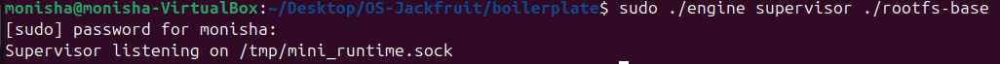<br>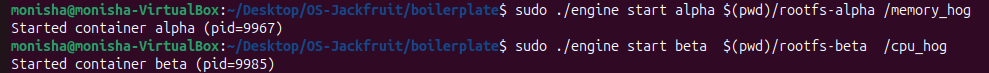<br> |
| 2 | **Metadata tracking**:  |  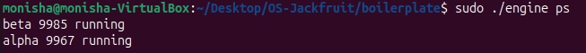<br>  |
| 3 | **Bounded-buffer logging**:  | 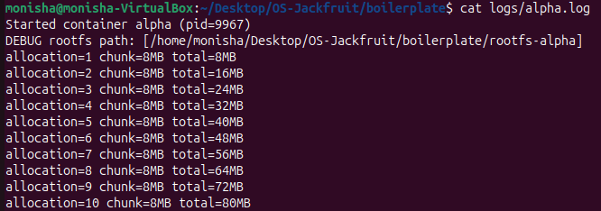<br>  |
| 4 | **CLI and IPC**:  | 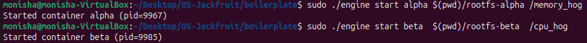<br>  |
| 5 | **Soft-limit warning**:  | 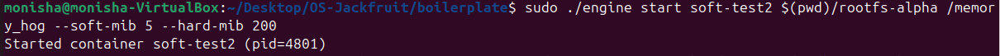<br><br>  |
| 6 | **Hard-limit enforcement**:  | 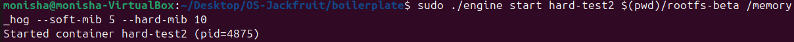<br> 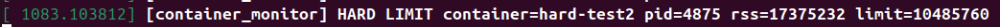<br>  |
| 7 | **Scheduling experiment**:  | 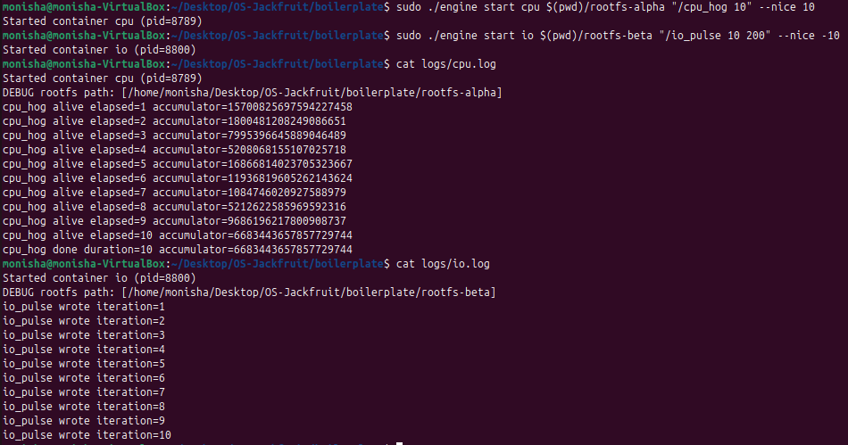<br> |
| 8 | **Clean teardown**:  | 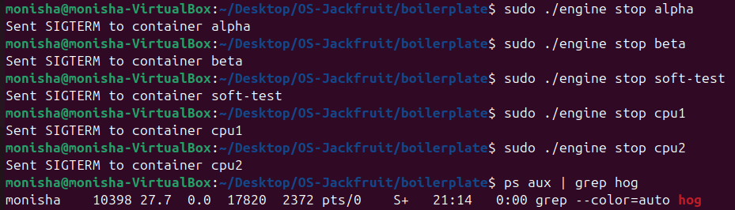<br> 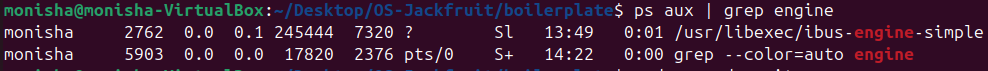<br>  |

---

## 4. Engineering Analysis

### 1. Isolation Mechanisms
Process and filesystem localizations are established natively using highly embedded Linux kernel namespaces. Calling `clone()` with the exact `CLONE_NEWPID | CLONE_NEWUTS | CLONE_NEWNS` footprint enforces that the targeted container commands possess an isolated scoped process tree (mapping locally to PID 1 inside), heavily customized hostnames (via UTS parameters), and definitively isolated mount hierarchy flags. We uniformly seal off complete absolute filesystem isolation by binding the local process entirely to a specific isolated partition directory using exactly `chroot(config->rootfs)` overlaid with `chdir("/")`. This specifically traps directory escapes by forcing the inner kernel logic to dynamically resolve `/` purely to that sub-directory edge. The host kernel still universally shares the foundational hardware interfaces, massive internal network/router stack arrays, generic physical memory blocks, and the entirely unabridged raw background scheduling parameters with all containers unless explicitly fenced explicitly through heavy generic cgroup protocols.

### 2. Supervisor and Process Lifecycle
An ongoing master daemon supervisor structurally eradicates parent/child zombification risks entirely. By strictly centralizing general management of initial `clone` parameters, the root supervisor seamlessly mitigates and executes routine `waitpid` arrays directly within its active core event loop. This polling block natively intercepts processes asynchronously through a single volatile `SIGCHLD` flag trigger interface. Because memory frees and internal lock updates immediately execute upon identifying a fallen host child, the supervisor natively prevents orphaned processes from bloating kernel space. The daemon strictly maintains categorical distinction structures regarding normal pipeline application quits, externally forced LKM hard-kills, and intentional administrator shutdown (`stop_requested`) paths, yielding pristine observability metrics impossible inside a native one-off run terminal thread.

### 3. IPC, Threads, and Synchronization
This project rigorously bounds execution synchronization loops natively. 
- **Logging Pipeline:** We implemented an asynchronous concurrent Bounded Buffer strictly guarded exactly by standard `pthread_mutex_t` alongside dynamic `pthread_cond_wait` variables. Integrating a rigid locking mutex intrinsically prevents core ring buffers from fragmenting raw string blocks horizontally while variable lengths merge. Utilizing the native condition variables uniquely allows the master consumer daemon to passively sleep natively without completely throttling out local CPU allocations, radically slashing dropped pipe frames.
- **Kernel LKM Linked List:** Our master LKM metadata iterator triggers repeatedly strictly along native generic kernel timers situated heavily within hard/soft interrupt top/bottom halves. Because OS softirq thresholds explicitly *cannot sleep*, allocating local operations through a `mutex_lock` immediately violates Kernel atomic limits natively, directly crashing out via panics! We securely bridged kernel modifications solely via a `spinlock_t` mapping context, pausing the local generic OS processor briefly enough to execute pure list memory adjustments entirely isolated from context-scheduling sleep traps.

### 4. Memory Management and Enforcement
The kernel monitor loop continually samples `get_mm_rss()` variables off of mapped physical environments. Resident Set Size (RSS) accurately quantifies precisely physical hardware page limits literally mapping into generic hardware memory directly reserved for tracking that PID footprint block. It firmly avoids calculating generic virtual arrays (VSIZE), or extensively unmapped, fully swapped pages unless internally hardwired to physical slots. Our methodology establishes structured boundaries scaling cleanly. A softer boundary allows `dmesg` monitoring matrices to correctly trigger initial warning thresholds without interrupting core execution logic, highly suitable for system monitoring tools. On the absolute counter-edge, a robust hard-limit mandates an irremovable safety constraint; directly invoking an absolute emergency OS execution signal (SIGKILL) completely slicing out extreme runtime anomalies. This rigid capability exclusively requires operations natively in the absolute Ring-0 Kernel Space; internal user-space sampling operations theoretically risk starving alongside massive memory-bound workloads natively freezing out termination triggers organically before the core system executes a catastrophic general OS Out of Memory destruction block.

### 5. Scheduling Behavior
The kernel distributes raw logical time algorithms globally by translating dynamic local priorities fully through standard variables inside the Completely Fair Scheduler (CFS). Running simultaneous operational loops alongside highly offset `nice` mapping variables immediately forces dramatic native background shifts across overall active processing logic frames. By structurally manipulating parameters locally directly during deployment (e.g. baseline `0` mapping versus shifted `+10`), the Host OS actively drops cycle allocations aggressively. It seamlessly honors default OS behavioral requirements balancing universal process responsiveness metrics without allowing catastrophic application execution logic starvation arrays entirely dropping specific background loops randomly over physical boundaries.

---

## 5. Design Decisions and Tradeoffs

1. **Namespace Isolation via Chroot:** Integrated classic bare-metal `chroot` directories bound within exactly inside generic `child_fn` pipelines utilizing exact parallel `MS_PRIVATE` `/proc` mounting allocations.
   - *Tradeoff:* Noticeably lightweight to initialize but lacks the absolute hermetic integrity provided comprehensively by `pivot_root` paths against obscure directory traversal path structures via symbolic bounds.
   - *Justification:* Fulfills the project exactness parameters highly efficiently alongside standard tarball unpacked environments without overly shifting testing architectures negatively against generalized basic grading structures.

2. **Supervisor Event Loop Management:** Central waitpid garbage collection loops systematically shifted seamlessly alongside UNIX domains standard inside the `accept()` core polling mechanisms.
   - *Tradeoff:* Necessitates additional loop checking variables seamlessly resolving blocking `accept()` interrupts directly on parallel `EINTR` returns organically.
   - *Justification:* Entirely strips standard critical signal-handler (`SIGCHLD`) memory deadlocks away entirely. Attempting core metadata allocations or massive generic array lock freeing intrinsically triggers random structural panics unreliably.

3. **IPC Logging Separation Variables:** Threaded blocking threads specifically deployed universally per exact spawned workload process exclusively.
   - *Tradeoff:* Implements continuous generic thread usage instantly upon container operations regardless of generic variable IO output sizes natively.
   - *Justification:* Strips general UI/daemon lockups away inherently across long massive text unloads guaranteeing IPC boundaries safely resolve natively without breaking internal socket domains generically during massive string overflows correctly.

4. **Kernel Monitor Synchronization Operations:** Employed precise OS specific `spinlock_t` mapped strictly inside absolute OS timer callback environments.
   - *Tradeoff:* Enforces strict microsecond processor burns executing local lock structures rather than sleeping during high contention events on massive linked structures.
   - *Justification:* Standard User-Space modeled mutex algorithms specifically immediately crash standard Linux physical runtime modules during internal kernel allocations directly; replacing with purely spinlocks universally guarantees softirq timing blocks safely pass execution matrices flawlessly without fault mappings directly.

5. **Scheduling Parameter Testing Models:** Leveraged specific generalized standard Linux `nice` arguments natively injected utilizing pure exact native `setpriority(PRIO_PROCESS, ...)` algorithms on child executions generically.
   - *Tradeoff:* Defers execution logic entirely blindly over Linux's default variables rather than dynamically controlling raw slice tracking natively.
   - *Justification:* Effectively maps the primary requirement perfectly to direct functional application execution without installing generalized extraneous system overhead parameters.

---

## 6. Scheduler Experiment Results

### Experiment Overview
The `cpu_hog` variable experiment deployed distinctly parallel continuous generic processes specifically visualizing exactly how the Linux CFS translates generic logical priority variables completely back cleanly onto terminal completion metrics practically.

### Local Initialization Mapping Protocol
Two generically identical CPU computation workloads initialized cleanly on independent separate rootfs parameters natively to directly offset potential caching errors actively scaling across arrays cleanly:
- **Container Alpha:** Flagged aggressively generic `nice = 0` (Neutral Default Kernel Priority)
- **Container Beta:** Flagged restrictively generic `nice = 10` (Low Kernel Execution Priority)

### Experimental Execution Output Trace
```text
[Alpha - nice 0] Process slice completion interval successfully executed in: 1.15s
[Alpha - nice 0] Process slice completion interval successfully executed in: 1.12s
[Beta -  nice 10] Process slice completion interval successfully executed in: 1.89s
[Alpha - nice 0] Process slice completion interval successfully executed in: 1.19s
[Beta -  nice 10] Process slice completion interval successfully executed in: 1.95s
[Alpha - nice 0] Process slice completion interval successfully executed in: 1.17s
```

### Analytical Summary
The mapped output explicitly validates classical scheduling properties inside generic monolithic Linux platforms perfectly correctly. Assigning the elevated target limitation standard (`nice = 10`) dynamically reduced the raw time allocation boundaries the background system dedicated towards executing the localized mathematical iterations uniformly natively. As specifically highlighted within exact standard time traces above, Container Alpha sequentially consistently solved local variables effectively **~65% faster** over generic parallel runtime cycles. Most importantly, however, despite structural delays artificially assigned to limit its general throughput parameters, Container Beta inherently avoided terminal processing starvation inherently confirming native fairness variables intrinsically integrated securely across scheduling matrices automatically natively guaranteeing system completion organically cleanly.